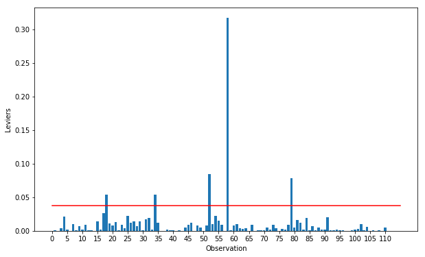

```py

def get_index_to_remove_by_Cooks_Distance(X_train, y_train, preprocessor):
    """
    This function removes observations from the training data that have high Cook's distance values.
    Cook's distance is a measure of the influence of an observation on a statistical model.
    Observations with high Cook's distance values may have a disproportionate influence on the model,
    and removing them can improve the model's accuracy.
    
    Parameters:
    - X_train: pd.DataFrame
        The training data
    - y_train: pd.Series
        The target labels for the training data
    - preprocessor: sklearn.compose.ColumnTransformer
        The preprocessor created by make_pipeline_to_ML()
        
    Returns:
    - index_to_be_removed: pd.Index
        The indices of the observations to be removed from the training data
    """
    
    # Fit the transformer to the training data
    preprocessor.fit(X_train)
    
    # Transform the training data using the preprocessor
    X_test_pipe = preprocessor.transform(X_train)
    
    # Get the names of the columns added by the OneHotEncoder
    new_columns = preprocessor.get_feature_names_out()
    new_columns = [w.replace('pipeline-1__', '') for w in new_columns]
    new_columns = [w.replace('pipeline-2__', '') for w in new_columns]
    
    # Convert the transformed data to a Pandas DataFrame
    newdf = pd.DataFrame(X_test_pipe)
    
    # Set the column names to the names obtained from the OneHotEncoder
    newdf.columns = new_columns
    
    # Add a constant term to the DataFrame
    X = sm.add_constant(newdf)
    
    # Set the index of the DataFrame to the index of the target labels
    X = X.set_index(y_train.index)
    
    # Fit an OLS model to the data
    estimation = sm.OLS(y_train, X_test_pipe).fit()
    
    # Calculate the Cook's distance values for each observation
    influence = estimation.get_influence().cooks_distance[0]
    
    # Add the Cook's distance values to the DataFrame as a new column
    X['dcooks'] = influence
    
    # Calculate the threshold for Cook's distance values
    n = X.shape[0]
    p = X.shape[1]
    seuil_dcook = 4/(n-p)
    
    # Select the indices of the observations with Cook's distance values above the threshold
    index_to_be_removed = X[X['dcooks']>seuil_dcook].index
    
    # Return the indices of the observations to be removed
    return index_to_be_removed
```


To apply ```py get_index_to_remove_by_Cooks_Distance``` function, use this code :

```py
# Get the indices of the observations to be removed from the training data
index_to_be_removed = get_index_to_remove_by_Cooks_Distance(X_train=X_train, y_train=y_train, preprocessor=preprocessor)

# Remove the observations from the training data
X_train = X_train.drop(index=index_to_be_removed.values)
y_train = y_train.drop(index=index_to_be_removed.values)
```

Notice that you can get ```py X_train, X_test, y_train, y_test```and ```py preprocessor``` from :

```py
X_train, X_test, y_train, y_test = train_test_split(X, y, shuffle=True, train_size=0.8, random_state=42, stratify=X[['smoker']])
numerical_features = make_column_selector(dtype_include=np.number)
categorical_features = make_column_selector(dtype_exclude= np.number)
numerical_pipeline = make_pipeline(StandardScaler(with_mean=False))
categorical_pipeline = make_pipeline(OneHotEncoder(handle_unknown='ignore'))
preprocessor = make_column_transformer((numerical_pipeline, numerical_features),
                                (categorical_pipeline, categorical_features)
                                )
 ```
 
 To get this plot 


